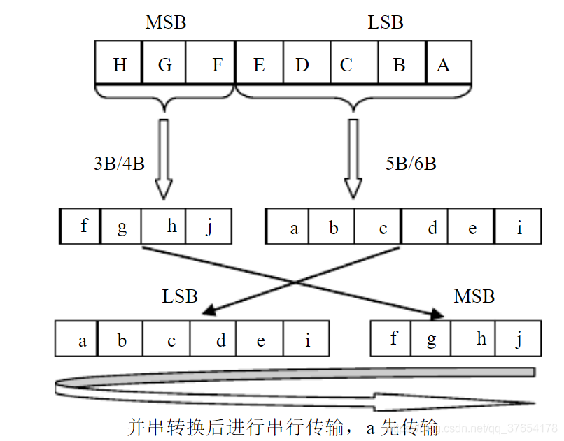

# 笔试面试

## **基础知识**

### 概念原理理解

1. 阻塞赋值和非阻塞赋值

   - 概念与定义：
     - 阻塞赋值：“=”  在赋值时先计算等号右边部分的值，这时赋值语句不允许任何其他的verilog语句干扰，知道现行赋值完成时刻，才允许别的赋值语句开始执行。
     - 非阻塞赋值：“<=”非阻塞赋值是由时钟节拍决定，在时钟上升到来时，执行赋值语句右边，然后将begin-end之间的所有赋值语句同时赋值到赋值语句的左边，注意：是begin—end之间的所有语句，一起执行，且一个时钟只执行一次。
   - 编码准则：
     - 时序电路建模时使用非阻塞赋值
     - 锁存器电路建模时使用非阻塞
     - 用always块建立组合逻辑模型时，用阻塞赋值；
     - 在同一个always块中建立时序和组合逻辑电路时用非阻塞。
     - 在同一个always块中，要即用非阻塞，又用阻塞赋值；
     - 不要在多个always块中对同一个变量赋值

2. 时序逻辑和组合逻辑；

   - 定义：
     - 组合逻辑电路在逻辑功能上的特点是任意时刻的输出仅仅取决于该时刻的输入，与电路原来的状态无关。
     - 时序逻辑电路在逻辑功能上的特点是任意时刻的输出不仅取决于当时的输入信号，而且还取决于电路原来的状态，或者说，还与以前的输入有关。

   有三个方面的不同：

   - 代码层面：时序逻辑的信号敏感列表中有时钟沿，组合逻辑的信号敏感列表是组合逻辑的信号或者是*
   - 电路层面:时序逻辑电路相当于在组合逻辑的基础上添加一个D触发器。
   - 波形图层面：组合逻辑的波形是即刻反应变化的，与时钟无关，但是时序逻辑的波形不会立刻反应出来，只有在时钟的上升沿发生变化。

3. 锁存器的结构及DFF的结构；

   - 锁存器：是电平触发的存储单元，数据存储的动作（状态转换）取决于输入时钟（或者使能）信号的电平值，尽当锁存器处于使能状态时，输出才会随着数据输入发生变化。

   - SR锁存器

   

   - 电平触发的触发器也称D锁存器

   

   - 边沿触发的触发器 通常所说的D触发器

     - 边沿触发器触发器的次态取决于clk信号下降沿（或者上升沿）到达时刻输入信号的状态。而在此之前和之后输入状态的变化对触发器的次态没有影响。

     

   - 寄存器： 通常把能够用来存储一组二进制代码的同步时序逻辑电路称为寄存器。寄存器可以由一触发器构成。

   - 在FPGA中使用锁存器的弊端：

     - 锁存器对毛刺敏感，不能异步复位，因此在上电后处于不确定的状态；
     - 锁存器会使静态时序分析变得非常复杂，不具备可重用性。，因为FPGA的EDA工具的时序分析是基于时序逻辑分析的，锁存器这种组合逻辑不利于EDA工具进行分析。
     - FPGA的基本单元是由查找表和触发组成，如果要生成锁存器，反而需要更多的资源。
     - 如果使用与非门搭建锁存器和触发器，锁存器好耗用的逻辑资源要比D触发器少（D触发器需要12个mos管，锁存器只需要6个mos管），锁存器的集成度更高。所以在的ASIC设计中会用到锁存器。但锁存器对毛刺敏感，无异步复位端，不能让芯片在上电时处在确定的状态；另外，锁存器会使静态时序分析变得很复杂，不利于设计的可重用，所以，在ASIC设计中，除了CPU这高速电路，或者RAM这种对面积很敏感的电路，一般不提倡用锁存器。

4. 高阻态的意义和用法；

   - 高阻态：

     - 指的是电路的一种输出状态，既不是高电平也不是低电平；
     - 如果高阻态接入下一级电路的话，对下级电路无任何影响，效果等同于没接；
     - 如用万用表测量的话，有可能是高电平也有可能是低电平，随负载而定。

   - 高阻态的实质：

     - 电路分析时高阻态可做开路理解。

     - 你可以把它看作输出（输入）电阻非常大，它的极限可以认为悬空。也就是说理论上高阻态不是悬空，它是对地或对电源电阻极大的状态。而实际

       用上与引脚的悬空几乎是一样的。

   - 高阻态的意义：

     - 当门电路的输出上拉管导通而下拉管截止时,输出为高电平;反之就是低电平;
     - 如上拉管和下拉管都截止时,输出端就相当于浮空（没有电流流动）,其电平随外部电平高低而定,即该门电路放弃对输出端电路的控制 。

   - 典型应用：

     - 在总线连接的结构上。总线上挂有多个设备，设备于总线以高阻的形式连接。这样在设备不占用总线时自动释放总线，以方便其他设备获得总线的使用权。　
     - 大部分单片机I/O使用时都可以设置为高阻输入，如凌阳，AVR等等。高阻输入可以认为输入电阻是无穷大的，认为I/O对前级影响极小，而且不产生电流（不衰减），而且在一定程度上也增加了芯片的抗电压冲击能力。
### 时序分析相关
1. 建立保持时间及建立保持时间的计算；

   - **Tsu : 建立时间**，目的寄存器自身特性决定，在时钟信号上升沿到达其时钟接口时，其数据输入端(D)的数据必须提前Nns稳定下来，否则就无法保证数据正确存储。 换句话说：**时钟上升沿之前数据必须稳定的最短时间**

   - **Tco ：** 时钟上升沿到达D触发器 到数据输出到Q端的延迟 

   **考虑数据延迟与时钟延迟的模型分析**

   

   - **时钟偏斜 skew**

     时钟从源端口出发，到达目的寄存器和源寄存器的时间差值。

   - 建立时间 /保持时间

     **Setup time:** 即建立时间，在时钟上升沿之前数据必须稳定的最短时间。若不满足setup time，数据无法进入寄存器：

     分析建立时间的公式1
     $$
     Tclk1 + Tco + Tdata  ≤ Tclk + Tclk2 -Tsu
     $$
     变形：
     $$
     Tclk + Tclk2 -Tsu - Tclk1 - Tco - Tdata ≥ 0
     $$

     $$
     Tclk + (Tclk2  - Tclk1 ) -Tsu - Tco - Tdata ≥ 0
     $$

     $$
     Tskew = Tclk2 - Tckl1
     $$

     $$
     Slack = Tclk + Tskew -Tsu - Tco - Tdata ≥ 0
     $$

     Slack ≥ 0 ，目的寄存器能够正确的接收源寄存器发射过来的数据，建立时间余量(Slack)。

     Slack 小于0 ，无法正确的接收数据

     Tclk1：时钟信号从时钟源端口出发，到达源寄存器时钟端口的时间

     Tco:	时钟上升沿到达寄存器时钟端口 到数据输出到寄存器Q端口的时间

     Tdata : 从源寄存器Q端出发，到达目的寄存器D端的时间

     Tclk : 时钟周期

     Tclk2：时钟信号从时钟源端口出发，到达目的寄存器时钟端口的时间

     Tsu :D触发器D端口的数据必须比时钟上升沿提前Nns到达D触发器的端口

     寄存器要求的其数据端口的值必须提前于时钟上升沿到达其时钟端口的时间值

     Tskew : 时钟从源端口出发，到目的寄存器和源寄存器时钟端口的时间差值（Tclk2 - Tclk1）

     Tclk1 + Tco + Tdata  ：数据到达时间（包含时钟和数据到达时间两部分）

     Tclk + Tclk2 -Tsu :数据需求时间

     Slack : 数据需求时间和数据到达时间的差值，如果为正值，则表明数据可以被正确的接收，反之，则不能被正确的接收。

   - **保持时间**

     **Hold time:** 即保持时间，**在时钟上升沿之后数据必须稳定的最短时间**。若不满足hold time 数据无法进入寄存器：Th < Tco

     Th 限制了数据传输的速度。如果Tco延时太短导致上一级寄存器锁存的数据侵占了下一级寄存器正在锁存数据的保持时间,那么下一级寄存器就无法有效的锁存数据,系统时序也就无法达到要求。
     
     

5. 建立时间满足，保持时间不满足是什么情况？

   - 如果Tco延时太短导致上一级寄存器锁存的数据侵占了下一级寄存器正在锁存数据的保持时间,那么下一级寄存器就无法有效的锁存数据,系统时序也就无法达到要求。
   - **结合上面的分析**

6. 时序约束的意义和做法；（时钟约束，IO约束，例外约束等）；

7. 时序路径

8. 什么是input delay  output delay 

9. 流片前和流片后的时序违例解决方法；

   - 流片前：
     - setup ：优化逻辑，增加流水，降低扇出
     - hold通常做clock tree平衡，再是塞buffer增加数据延迟

   - 流片后，
     - 对于setup的话，可以降低时钟频率
     - 应该是无法彻底解决hold违背问题，不过可以定位是不是hold违背产生的，先把频率降低（避免setup违背），再给片子升温（可以直接用吹风机吹）到一定温度（要低于可以工作的最大温度），因为cell的特性是温度高，延时大，如果升温前不可以工作，但升温后可以工作，基本可以判定是hold违背的问题。当然也可能有其它原因，这只是手段之一。
### 跨时钟域的处理与FIFO

1. 跨时钟及其解决方法（单bit、多bit、打拍、握手等在什么场合需要）；
    - 跨时钟域主要是解决两个问题：异步处理；保证采到数据
    - 1bit信号：
      - 异步处理，将信号打2拍
      - 保证采到数据：主要是靠考虑慢时钟采快时钟域的数据可能会采不到数据

        - 保证快时钟域的信号保持时间大于1个周期的慢时钟域的时钟。
    - 多bit信号：
       - 异步处理：多比特信号进行打拍是不能保证信号的正确性的，所以要过异步fifo
       - 另外可以使用valid + data 的形式传输，对于valid的跨时钟域的处理就是1bit的跨时钟域的处理问题，注意要保证数据保持的时间可以被采到。

10. 异步fifo，空满判断；

   - [fifo空满判断与格雷码](https://blog.csdn.net/moon9999/article/details/77943407 )
   - [异步FIFO同步化设计](https://blog.csdn.net/moon9999/article/details/77822606)
### 亚稳态与竞争冒险
1. 亚稳态的成因，危害，解决方法；

    - 亚稳态是指触发器无法在某个规定时间段内达到一个可确认的状态。当一个触发器进入亚稳态时，既无法预测该单元的输出电平，也无法预测何时输出才能稳定在某个正确的电平上。在这个稳定期间，触发器输出一些中间级电平，或者可能处于振荡状态，并且这种无用的输出电平可以沿信号[通道](https://so.csdn.net/so/search?q=通道&spm=1001.2101.3001.7020)上的各个触发器级联式传播下去。
    - 成因
      - 输入信号是异步信号
      - 时钟偏移超过容限值
      - 信号在两个不同频率或者同频不同相的时钟域下工作
      - 组合延时使触发器的输入信号在亚稳态窗口内发生变化
      - 在同步系统中，如果触发器的setup time / hold time不满足，就可能产生亚稳态，
    - 亚稳态的危害
      - 由于输出在稳定下来之前可能是毛刺、振荡、固定的某一电压值，因此亚稳态除了导致逻辑误判之外，输出0～1之间的中间电压值还会使下一级产生亚稳态（即导致亚稳态的传播）。 逻辑误判有可能通过电路的特殊设计减轻危害（如异步FIFO中Gray码计数器的作用），而亚稳态的传播则扩大了故障面，难以处理。
    - 亚稳态的解决办法
      - 对异步信号进行同步处理（采用同步器）；
      - 采用FIFO对跨时钟域数据通信进行缓冲设计；  
      - 对复位电路采用异步复位、同步释放方式处理；  
      - 使用采样相应更快的触发器(亚稳态窗口小)；  
      - 降低采样速率（降频）；

13. 竞争和冒险的区别、成因、危害、处理方法；

    - 在组合逻辑中，由于门的输入信号通路中经过了不同的延时，导致到达该门的时间不一致叫竞争。

    - 产生毛刺叫冒险。

    - 如果布尔式中有相反的信号则可能产生竞争和冒险现象。

      方法：接入滤波电容、引入选通脉冲、修改逻辑设计-增加冗余项

3. 毛刺的成因、危害、处理方法；

    - 同上

### 低功耗设计

1. 低功耗常见设计方法，动态/静态功耗计算和分析，门控时钟、电源门控等；
### ASIC设计与FPGA设计
1. ASIC设计和FPGA设计的flow；

    - ASIC设计流程：前端设计+后端设计（与工艺相关）

      - 前端设计：

        RTL级代码----功能仿真----逻辑综合----等价性检查，形式验证----静态时序分析

      - 后端设计：

        布局规划—布局布线----版图物理验证（包括LVS和DRC等）----流片
        
        RTL级代码：使用verilog语言进行描述我们想要实现的电路功能
        功能仿真：检查代码有没有语法问题或者实现的功能和我们预计设计的是否相同
        逻辑综合：把代码语言描述的模块转化成包含与，或，非，寄存器等基本的逻辑单元的网表
        形式验证：从功能上，对综合后的网表进行验证，检查验证生成的网表功能是否与设计的电路功能相同
        静态时序分析：从时序上，进行验证，检查电路是否存在时序上的问题
        布局规划：规划芯片上的各种功能电路的摆放位置
        布局布线：连接单元和功能块之间的互连布线线
        版图物理验证：对完成布线的物理版图进行功能和时序上的验证（包括DRC和LVS等）
        流片

    - FPGA设计流程：

      -  RTL级代码----功能仿真-----逻辑综合-----门级仿真-----布局布线----时序仿真----版级验证与仿真

      对于设计而言，我们想要设计一个芯片，首先我们要明确我们设计的芯片旨在解决什么样的问题，具有什么样的功能。

      我们根据目的去设计电路，把电路按照功能模块或接口划分，使用硬件描述语言verilog或HDL去实现逻辑设计，生成RTL级的代码，然后我们对这个代码进行功能仿真，检查代码有没有语法问题或者实现的功能跟我们预计的是否相同（代码行为的正确性），接着我们把它进行逻辑综合，（逻辑综合需要有约束条件，约束条件就是你希望综合出来的电路在面积，时序等目标参数上达到的标准，）

      由于逻辑综合需要基于特定的库，不同的库，基本单元电路的对应的面积和时序参数都是不一样的，所以我们还需要进行后仿真也就是门级仿真，从功能和时序两方面对综合后的网表进行验证，保证电路的正确性，以及逻辑综合后生成的网表并没有改变原先电路设计的功能是自带工具完成。接下来我们对芯片的面积做一个规划，确定每个单元的位置，并完成互连布线（连接单元和功能块之间的互连布线线），然后我们再做一个时序仿真，电路提取，加延迟，仿真后包含延迟信息，接近于真实电路的行为，烧到板子上，进行仿真，测试
          
      FPGA设计和ASIC设计有本质的区别，**FPGA是一种可编程门阵列逻辑电路器件，是基于SRAM查找表逻辑形成的结构，FPGA最终生成的是产生可以实现所需功能电路的编程数据；**
      FPGA设计流程：在后仿真（时序仿真）后，产生用于编程的下载文件，烧录到板子上，进行测试和运行，前面基本差不多，但也有区别。
### Verilog
1. Verilog 延时模型；

- [[SV]Verilog中的延时模型](https://blog.csdn.net/gsjthxy/article/details/106202236?ops_request_misc=%257B%2522request%255Fid%2522%253A%2522163218892116780357226514%2522%252C%2522scm%2522%253A%252220140713.130102334..%2522%257D&request_id=163218892116780357226514&biz_id=0&utm_medium=distribute.pc_search_result.none-task-blog-2~blog~sobaiduend~default-1-106202236.pc_v2_rank_blog_default&utm_term=verilog+%E5%BB%B6%E6%97%B6%E6%A8%A1%E5%9E%8B&spm=1018.2226.3001.4450)
  
    - 
    
    - 块延时（Lumped Delay）
    
      - 块延时方法是将全部延时集中到最后一个门上。这种模型简单但不够精确，只适用于简单电路。因为当到输出端有多个路径时不能描述不同路径的不同延时。
    
      - 可以用这种方法描述器件的传输延时，并且使用最坏情况下的延时(最大延时）。
    
        ```verilog
        `timescale 1ns/ 1ns
             
         module noror( Out, A, B, C);
        	output Out;
        	input A, B, C;
             
            nor n1 (net1, A, B);
            or #3 o1 (Out, C, net1);
             
        endmodule
        ```
    
        
    
    - 分布式延时（Distributed Delays）
    
      **分布延时方法是将延时分散到每一个门**。在相同的输出端上，不同的路径有不同的延时。分布延时有两个缺点：
    
      - 在结构描述中随规模的**增大而变得异常复杂**。
    
      - **仍然不能描述基本单元 (primitive) 中不同引脚上的不同延时**
    
        ```verilog
        `timescale 1ns/ 1ns
         
        module noror( Out, A, B, C);
          output Out;
          input A, B, C;
         
          nor #2 n1 (net1, A, B);
          or   #1 o1 (Out, C, net1);
         
        endmodule
        ```
    
        
    
    - 模块路径延时（Module Path Delays）
    
      **在专用的specify块描述模块从输入端到输出端的路径延时。**
    
      - 准确性：所有路径都能够精确说明
    
      - 模块性：时序与功能分开说明
    
        
### 总线接口
1. AHB、APB、AXI等总线；

    - AHB
    - APB
    - AXI
      - AXI常用的是AXI4 AXI3(zynq 中的PS) AXI又分为axi-lite AXI4-full 、AXI-stream
        - AXI-Full :有5个通道
          - Write address channel
          - write data channel
          - Write response channel
          - read address channel
          - read data channel
2. SPI、UART、I2C、USB等外设；
### 复位设计
1. 同步复位、异步复位及优缺点，有复位和无复位的综合实现区别；

    - **同步复位原理**：同步复位只有在[时钟](http://www.elecfans.com/tags/时钟/)沿到来时复位信号才起作用，则复位信号持续的时间应该超过一个时钟周期才能保证系统复位。

    - **异步复位原理：** 异步复位只要有复位信号系统马上复位，因此异步复位抗干扰能力差，有些噪声也能使系统复位，因此有时候显得不够稳定，要想设计一个好的复位最好使用异步复位同步释放。

    - **同步复位与异步复位的区别：**主要看是否有时钟信号参与。异步复位不需要时钟参与，一旦信号有效立即执行复位操作；同步信号需要时钟参与，只有有效的时钟信号出现，复位信号才有效。

    - **同步复位：** 同步复位就是指复位信号只有在时钟上升沿到来时才有效。否则无法完成对系统的复位工作。

      ```verilog 
      always @ (posedge clk) begin
          if (!rst_n) begin
              ……
          end else begin
          
          end    
      end
      ```

    - **异步复位：** 他是指无论时钟沿是否到来，只要复位信号有效，就对系统进行复位，

      ```verilog
      always @ (posedge clk or posedge rst) begin
          if (rst) begin
             …… 
          end else begin
          end
      end
      ```

    - 优缺点：

      - 同步复位
        - 优点
          1. 有利于仿真器的仿真
          2. 可以使所设计的系统成为100%的同步时序电路，这便大大有利于时序分析，而且综合出来的fmax一般比较高。
          3. 因为他只有在时钟有效电平到来时才有效，所以可以滤除高于时钟频率的毛刺。
        - 缺点
          1. 复位信号的有效时长必须大于时钟周期，才可以被系统设别并完成复位任务。同时还要考虑诸如clk skew 组合逻辑路径延时，复位延时等因素。
          2. 由于大多数的逻辑器件在目标库内的DFF都只有异步复位端口，所以，倘若采用同步复位的话，综合器就会在[寄存器](http://www.elecfans.com/tags/寄存器/)的数据输入端口插入组合逻辑，这样就会耗费较多的逻辑资源。
      - 异步复位
        - 优点：
          1. 大多数目标器件库的dff都有异步复位端口，因此采用异步复位可以节省资源。
          2. 设计相对简单。
          3. 异步复位信号识别方便，而且可以很方便的使用[FPGA](http://www.elecfans.com/tags/fpga/)的全局复位端口GSR。
        - 缺点:
          1. **在复位信号释放**（release）的时候**容易出现问题**。具体就是说：倘若复位释放时恰恰在时钟有效沿附近，就很容易使寄存器输出出现亚稳态，从而导致亚稳态。
          2. 复位信号容易受到毛刺的影响。

    - **总结：**推荐使用**异步复位、同步释放的方式**，并且复位信号为低电平有效。

      - 电路图：

        

      - 电路解释：是指复位信号到来的有效与否与 clk 无关，而且复位信号的撤除也与 clk 无关，但是复位信号的撤除是在下一个 clk 来到后才起的作用。

      - 电路目的： **为了防止复位信号撤除时，可能产生的亚稳态**

      - 电路详解：

        异步复位：复位信号 rst_sync_n 由高拉低时实现异步复位。同步释放：这个是关键，即当复位信号 rst_async_n 撤除时（由低拉高），由于双缓冲电路（双寄存器）的作用，rst_sync_n 不会随着 rst_async_n 的撤除而撤除。假设  rst_async_n 撤除时发生在 clk 上升沿，如果不加此电路则可能发生亚稳态事件，但是加上此电路以后，假设第一级 D 触发器 clk 上升沿时 rst_async_n 正好撤除，（第一个DFF 此时是出于亚稳态的；假设此时识别到高电平；若是识别到低电平，则增加一个 Delay）则 DFF1 输出高电平，此时第二级触发器也会更新输出，但是输出值为前一级触发器 clk 来之前时的 Q1 输出状态，显然 Q1 之前为低电平，所以第二级触发器输出保持复位低电平，直到下一个 clk 来之后，才随着变为高电平，即同步释放。

        ```verilog
        module reset_gen ( output rst_sync_n, input clk, rst_async_n);
         reg        rst_s1, rst_s2;
         wire       rst_sync_n ;
        
        always @ (posedge clk or negedge rst_async_n) begin
            if (!rst_async_n) begin   
                rst_s1 <= 1'b0;  
                rst_s2 <= 1'b0;  
            end  
            else begin  
                rst_s1 <= 1'b1;  
                rst_s2 <= rst_s1;  
            end  
        end
        
        assign rst_sync_n = rst_s2;  
         
        endmodule          
        
        ```

    - 有复位和无复位的综合实现区别 ：==**待补充**==

2. 同步复位、异步释放

    - 详情见上题分析


### 编码

#### 格雷码

1. 格雷码

- **概念：**

  在一组数的编码中，若任意两个相邻的代码只有一位二进制数不同，则称这种编码位格雷码（gray code）,另外由于最大数和最小数之间也仅有一位数不同，即“首位相连”，因此又称循环码或反射码。

  格雷码的用途：格雷码除了跨时钟与的计数器设计，如异步FIFO的读写地址，其他场合用的不多，否则每个计数器都要考虑格雷码那得多累啊。

  | 十进制 | 4位二进制码 | 4位格雷码 | 十进制 | 4位二进制码 | 4位格雷码 |
  | ------ | ----------- | --------- | ------ | ----------- | --------- |
  | 0      | 0000        | 0000      | 8      | 1000        | 1100      |
  | 1      | 0001        | 0001      | 9      | 1001        | 1101      |
  | 2      | 0010        | 0011      | 10     | 1010        | 1111      |
  | 3      | 0011        | 0010      | 11     | 1011        | 1110      |
  | 4      | 0100        | 0110      | 12     | 1100        | 1010      |
  | 5      | 0101        | 0111      | 13     | 1101        | 1011      |
  | 6      | 0110        | 0101      | 14     | 1110        | 1001      |
  | 7      | 0111        | 0100      | 15     | 1111        | 1000      |

  相邻的数字编码之间只有1bit不同。

  格雷码的好处是什么？相邻的数字编码之间只有1bit不同。这有1bit 不同，这样在数字发生跳变时可以理解成单bit跨时钟域的问题。

- **二进制转格雷码方法**：
  二进制码转成二进制格雷码，其法则是保留二进制码的最高位作为格雷码的最高位，而次高位格雷码为二进制码的高位与次高位相异或，而格雷码其余各位与次高位的求法相类似。
  示例：

  某二进制数为：$B_{n-1}B_{n-2}\cdots B_{2}B_{1}B_{0}$

  其对应的格雷码为：$G_{n-1}G_{n-2}\cdots G_{2}G_{1}G_{0}$

  其中：最高位保留—— $G_{n-1} = B_{n-1}$
  			其余各位—— $ G_i = B_{i+1}\oplus B_i i=0,1,2\cdots ,n-2$
      例：二进制数为：

  ​    

  4位二进制转为格雷码的实现代码如下：

  ```verilog
  assign dout[3] = din[3];
  assign dout[2] = din[3]^din[2];
  assign dout[1] = din[2]^din[1];
  assign dout[0] = din[1]^din[0];
  ```

#### 8B10B

1. aurora_8b10b编码，为什么？原理？

    - 为什么需要8b10B编码？

    - 简单的说是为了直流均衡，在高速串行总线中，通常采用交流耦合的方式，即在发送端（Tx）串接电容，根据电容“隔直流，通交流”的特性，或者理想电容的阻抗公式： 	xxxxx 	信号的频率越高，电容阻抗越低，当数据位流中出现多个连续的0或者1时，可以认为这段时间内信号是直流，电容的损耗变大，导致信号的幅度降低，直流信号被滤除，到最后无法识别出是1还是0。

    - 8B/10B编码以字节为单位，将数据映射成10位宽度的数据（具体映射方式可查表），使得编码后的二进制数据流中1和0的数量基本保持一致，同时确保字节同步易于实现。

    - **原理**

      - 历史背景：8B/10B编码是1983年IBM公司的AI 	Widmer和PeterFranaszek提出的输出传输编码标准[,]()目前广泛应用在高速串行总线中。

      - 假设原始8bit数据从高到低采用HGFEDCBA表示，8B/10B编码将8位数据分成高三位HGF和低5位EDCBA两个子组，然后经过5B/6B编码，将低5位EDCBA映射成abcdei;高三位经过3B/4B映射成fghj,最后合成abcdeifghj发送，发送时由于是小端模式，a先发送，其对应关系如下图所示：

        

        通常，认为会将低5位EDCBA按其十进制数值记为x，将高3位按其十进制数值记为y，将原始8bit数据记为D.x.y。例如8bit数“101 10101”，即十进制数181，按照上述划分原则 x=10101（21），y=101（5），所示这个数被表示为D.21.5。此外在8B/10B编码中，还需用到12种控制字符，用来标识传输数据的开始和结束，传输空闲等状态，按照上述规则，将控制字符记为K.x.y。

        这个时候问题来了，8位原始数据对应256个码，加上12种控制字符，而编码后的10位数据有1024个码，肯定有很多是用不到的，故需选择其中一部分来表示8bit数据，所选的码字0和1的数量应尽可能相等。

        表1所示为5B/6B编码映射关系表2：

        

        表2所示为3B/4B编码映射关系表：

        

        表3所示为8B/10B编码映射关系表[3]()：其映射原理将在下文中阐述

        

27. DDR效率太低怎么调整才能提高效率？

28. Serdes误码了怎么办？

4. 高速通道时钟偏移怎么办？

5. 断言SVA

6. 如何考虑PPA

7. 计算机体系结构常识：Cache、MMU，TLB，中断，DMA，大小端，流水线，超标量，超流水，超长指令字，数据冒险，控制冒险，分支预测，乱序执行，LRU等。（进程/线程调度，CPU调度，内存调度，总线分配）；
### FPGA 底层组成
1. xilinx 7系列FPGA底层的基本结构是什么？Altera stratix IV呢？

6. 64个if else综合出来底层是什么 LUT

7. 三段式状态机，状态转移时如何保证状态不乱跳（在case上面增加一个状态赋值为IDLE）

8. cordic原理及精度

## 手撕代码

懂原理，会手撕，并且根据题目要求写出不同变种的代码，比如怎么写资源占用最少等；

1. 异步fifo；
2. 同步fifo；
   - 主要是考FIFO的设计思路，需要两套指针系统，分别为读地址指针，和写地址指针。
3. 格雷码及格雷码和二进制的互相转换；
4. 除法器；
5. 超前进位加法器；
6. 边沿检测，输入消抖，毛刺消除；
7. 异步复位同步释放；
8. 三种计数器。二进制，移位，移位+反向；
9. 无毛刺时钟切换；
10. 串并转换；
11. 线性反馈移位寄存器；
12. 握手实现CDC；
13. 脚本编写（perl、python等）；
14. 奇偶校验
15. 其他简单功能的HDL实现及状态转换图：序列检测，回文序列检测，奇、偶、分频，自动售货机等；


## 题目部分

1. 最大项，最小项，组合逻辑变换为与非/或非形式，卡诺图化简；
2. 常用元件的门电路实现。（非，与非，或非，锁存器（两种），DFF）；
3. MOS管实现门电路；
4. MUX或者MUX+Inverter实现异或，或者其他简单逻辑功能；
5. 门电路实现逻辑表达式；
6. 门电路真值表；
7. 门电路实现同步时序逻辑；
   1.状态转换图或者状态转换表。
   2.状态化简。
   3.状态分配。
   4.卡诺图化简求出状态方程，驱动方程，和输出方程，自启动修改。
   5.画出逻辑图。例如售货机的门电路D触发器实现。
8. 门电路实现波形：常见的计数器，线性反馈移位等等；
9. 门电路实现Verilog代码；
10. Verilog常用语法：例如两操作数运算符和一操作数运算符；task和function区别；时钟激励的写法；可综合/不可综合语句；操作数有X和Z时的返回值；
11. FIFO深度计算，一般是背靠背；


## 其他问题

偶尔被问到，挺有启发意义。

1. if、case、三目运算符的区别；（其实现在工具综合出来区别不大）；
2. 超高速（Gbps）CDC时格雷码的不可靠问题；
3. 串扰；
4. ESD；
5. 闩锁效应；
6. 上拉下拉电阻；
7. 线与，OC，OD门；
8. 施密特触发器；
9. CMOS与TTL电平，相互驱动关系；
10. Cordic算法；
11. FPGA的基本资源与内部构造，对于FDCE，LDCE的实现；
12. FPGA的时钟资源及构造；
13. 同步时钟和异步时钟。时钟相移之后还是同步的吗？倍频或者分频呢？
14. PLL+MMCM。他们的输入输出，使用的注意点等等；
15. 计算机网络常识。NAT，地址映射，TCP/IP 4层网络模型；
16. PMOS管和NMOS管的结构以及区别，增强型和耗尽型；采用不同的MOS管实现电路的速度区别；电子导电比空穴能力强；
17. IC设计常用术语；
18. Verilog二维数组初始化。常用于FIFO设计；
19. 2态数据类型与4态数据类型对仿真速度的影响；
20. 综合中input 、output delay如何设置；
21. 术语的解释，比如MMU（Memory Manage Unit）等；


如果有时间，还可以学一些后端以及测试、验证的知识，SV，脚本等等。因为很多公司笔试题都会考一些测试的知识点，断言，覆盖率，SV语法等等。

还有外企一般考察范围都很广，设计，验证，后端，模拟都会涉及。

另外，企业的笔试面试内容和本身企业主业关系也很大，

做存储的就会问Flash或者RAM的知识，

做芯片的就会问CPU体系结构,

做FPGA偏爱用FPGA做项目的,

做GPU的会问计算机图形学的东西，图像处理的会问例如图像噪声一类的。