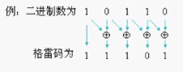

# 明德杨笔试题目讲解


## 格雷码

write a sequence of 3-bit grey code.can you derive a general equation to convert binary to grey code? [AMD 2008]

 [题目分析：此题考核

1. 对格雷码的认识；
2. 考核二进制转格雷码的方法

**格雷码：**

### 概念：

在一组数的编码中，若任意两个相邻的代码只有一位二进制数不同，则称这种编码位格雷码（gray code）,另外由于最大数和最小数之间也仅有一位数不同，即“首位相连”，因此又称循环码或反射码。

格雷码的用途：格雷码除了跨时钟与的计数器设计，如异步FIFO的读写地址，其他场合用的不多，否则每个计数器都要考虑格雷码那得多累啊。

| 十进制 | 4位二进制码 | 4位格雷码 | 十进制 | 4位二进制码 | 4位格雷码 |
| ------ | ----------- | --------- | ------ | ----------- | --------- |
| 0      | 0000        | 0000      | 8      | 1000        | 1100      |
| 1      | 0001        | 0001      | 9      | 1001        | 1101      |
| 2      | 0010        | 0011      | 10     | 1010        | 1111      |
| 3      | 0011        | 0010      | 11     | 1011        | 1110      |
| 4      | 0100        | 0110      | 12     | 1100        | 1010      |
| 5      | 0101        | 0111      | 13     | 1101        | 1011      |
| 6      | 0110        | 0101      | 14     | 1110        | 1001      |
| 7      | 0111        | 0100      | 15     | 1111        | 1000      |

相邻的数字编码之间只有1bit不同。

格雷码的好处是什么？相邻的数字编码之间只有1bit不同。这有1bit 不同，这样在数字发生跳变时可以理解成单bit跨时钟域的问题。

### 二进制转格雷码方法：

二进制码转成二进制格雷码，其法则是保留二进制码的最高位作为格雷码的最高位，而次高位格雷码为二进制码的高位与次高位相异或，而格雷码其余各位与次高位的求法相类似。

示例：

某二进制数为：$B_{n-1}B_{n-2}\cdots B_{2}B_{1}B_{0}$

其对应的格雷码为：$G_{n-1}G_{n-2}\cdots G_{2}G_{1}G_{0}$

其中：最高位保留—— $G_{n-1} = B_{n-1}$

​			其余各位—— $ G_i = B_{i+1}\oplus B_i i=0,1,2\cdots ,n-2$

例：二进制数为：



4位二进制转为格雷码的实现代码如下：

```verilog
assign dout[3] = din[3];
assign dout[2] = din[3]^din[2];
assign dout[1] = din[2]^din[1];
assign dout[0] = din[1]^din[0];
```

  


## 跨时钟域

怎样将一个 single-bit 信号从快时钟域送到慢时钟域，或慢送到快？Multi-bit 信号呢？[AMD 2008]

**题目分析**：这是一道关于跨时钟域处理的问题。跨时钟域可以分为四种情况：

1. 1bit信号
   - 由快时钟域到慢时钟域；
   - 由慢时钟域到快时钟域；
2. 多bit信号：
   - 由快时钟域到慢时钟域
   - 由慢时钟域到快时钟域

要解决这两个问题：1、异步处理；2、能采到数据。

### 异步处理:

打两拍，经过两个D触发器。

多bit：

​	过异步FIFO

​	添加一个valid 信号，在valid 有效期间，数据保持不变，通过异步处理valid 信号来取数据。

### 保证采到数据

#### 慢时钟采快时钟的数据

慢时钟采快时钟的数据，必须保证快时钟域的信号保持时间要大于1个慢时钟的时间。通过取边沿的方式只触发一次。

#### 快时钟采慢时钟的数据

数据都可以采到，只需要考虑数据的对错，也就是异步的处理

## P3 序列检测

设计一个连续计算Leading Zeros 个数的电路，输入8bit,输出4-bit[AMD 2008]

00001000	0100

00100010    0010

10001000	0000

可以parameterize你的设计吗？其hardware是什么样子的？？

```verilog
module leading_zeros(

);
 
    always @ (posedge clk or posedge rst)
    begin
        if (rst) begin
           cnt <= 0;
            cs <= IDLE;
        end else begin
            case (cs) 
                IDLE : begin
                    if(din[DATA_WIDTH-1-cnt]) begin
                        CS <= STOP;
                    end else begin
                        cnt <= cnt +1'b1;
                        CS <= WAIT_ONE;
                    end
                end
                WAIT_ONE : begin
                     if(din[DATA_WIDTH-1-cnt]) begin
                        CS <= STOP;
                    end else begin
                        cnt <= cnt +1'b1;
                        if(cnt > DATA_WIDTH-1)
                            CS <= STOP;
                        else
                        	CS <= WAIT_ONE;
                 end
                    
                STOP :begin
                    datavalid <= 1'b1;
                    CS <= IDLE;
                end
                
            endcase
        end
    end
    
endmodule
	
	always @ (*) begin
        generate for () 
            if(din[N-1-i])
                valid = 0;
            if(!din[N-1] & valid)
                cnt =cnt +1;
            
	end 
                
            generate for (i =0; i< N; i =i +1) begin
                if (i==0) 
                    if (1&！din[N-1-i])
                        cnt = cnt + 1;
                	else
                        cnt=0;
                else
                    if ()
            end
                
                
                
                
                
```

```verilog
valid = 1;
always @ (*) begin
    case(valid)
        1：begin
            if(valid & !din[N-1-i] ) begin
                valid =1;
                i = i + 1;
                if (cnt >N-1) begin
                    dout = i;
                	valid =1
                	i = 0;
                end
            end else begin
                dout = i;
                valid =0
            end   
        end
        
        0: begin
            valid =1
            i = 0;
        end
    endcase
  

```


## P4 

给出下面两个状态机的逻辑综合图，并说明两种写法的优缺点！[凹凸 2008]


```verilog
always @(posedge clk or negedge rst)
     if(!rst)begin
         state<=0;
         out<=4'b0000;
     end
     else
		case(state)
             0:begin
                 state<=1;
                 out<=4'b0000;
             end
             1:begin
                 state<=0;
                 out<=4'b0001;
             end
      	endcase


always @(posedge clk or negedge rst)
 if(!rst)
     state<=0;
 else
	case(state)
         0:state<=1;
         1:state<=0;
     endcase
 
always@(state)
	if(!state)
 		out=4'b0000;
	else
 		out=4'b0001;
```


第二个相比于第一个提高程序的可读性，可维护性高，第二个比第一个节约D触发器


## P5 设计地址生成器

【nVIDIA 2008】

 要求依次输出以下序列： 

0,8,2,10,4,12,6,14,1,9,3,11,5,13,7,15, 

16,24,18,26,.................................,31,

 32,40,34,42,.................................,47,

48,56,50,58,.................................,63,

64,72,66,76,.................................,79

```verilog 

reg [0:0] cnt;
reg [7:0] cnt_1;
reg [7:0] data[15:0]
always @ (posedge clk or posedge rst) begin
    if (rst) begin
    	cnt <= 'd0;
        opt_flag <= 1'd1;
    end else begin
        if (cnt) begin
            if (cnt_1 ==8) begin
                cnt_1 <= cnt_1 + 1;
                data[cnt_1] <= cnt ;
            end else if (cnt_1 <=15) begin
                opt_flag <= !opt_flag;
                if (opt_flag) begin
                    data[cnt_1] <= data[cnt_1 -1] + 8;
                end else begin
                    data[cnt_1] <= data[cnt_1 -1] - 6;
                end
                if (cnt_1 == 15) begin
                    cnt_1 <= 0;
                    cnt <= cnt + 1;
                end else begin
                    cnt_1 <= cnt_1 + 1;
                end
        end else 
            if (cnt_1 ==0) begin
                cnt_1 <= cnt_1 + 1;
                data[cnt_1] <= cnt ;
            end else if (cnt_1 <=7) begin
                opt_flag <= !opt_flag;
                if (opt_flag) begin
                    data[cnt_1] <= data[cnt_1 -1] + 8;
                end else begin
                    data[cnt_1] <= data[cnt_1 -1] - 6;
                end
                if (cnt_1 == 7) begin
                    //cnt_1 <= 0;
                    cnt_1 <= cnt_1 + 1;
                    cnt <= cnt + 1;
                end else begin
                    cnt_1 <= cnt_1 + 1;
                end
            end
        end 
    end
end


reg [3:0] cnt_2;
reg [7:0] addr [15:0]
always @ (posedge clk or posedge rst) begin
    if (rst) begin
        cnt_2 <= 0;
        cnt_3 <= 0;
    end else begin
        if (cnt_3 < 15) begin
            cnt_3 <= cnt_3 + 1'b1;
        end else begin
            cnt_3 <= 'd0;
        end
        
        if (cnt_3 == 15 ) begin
            if(cnt_2 ==3)
            	cnt_2 <= 'd0;
			else 
                cnt_2 <= cnt_2 + 1;
        end else begin
            cnt_2 <= cnt_2;
        end
        
    end 
end

always @ (posedge clk ) begin
    if (cnt_2 == 0)
    	addr[cnt_2][cnt_3] <= data[cnt_3] +16;
    else 
        addr[cnt_2][cnt_3] <= addr[cnt_2 -1][cnt_3] +16;
end

```

 

## 阻塞赋值与非阻塞赋值

阻塞赋值和非阻塞赋值的区别[Trident]

```verilog
always@(posedge clk) 	always@(posedge clk)
 begin					 	begin
 	b=a; 						b<=a;
 	c=b; 						c<=b;
 end 						end
 上面两段代码的硬件结构是怎么样的？

```

区别：

阻塞赋值：顺序执行，执行完上一条再执行下一条，

非阻塞赋值：一块赋值的。

第二个里会有两个触发器。

## P8


化简代码使硬件尽可能少[Trident]

```verilog
 always@ (sel or a or b or c) 
    if(sel) 
		y = a + b; 
	else 
		y = a + c
```


```verilog
reg [7:0] temp;
always @ (*)
    if (sel)
    	temp = b;
	else 
        temp = c;
always@(*)
    y = a+ temp;
```


## P9

2进制的1101.101变成十进制是多少？？？？[Trident]

```verilog
reg [6：0] din;
always @ (posedge clk) begin
    整数：dout <= din[6] << 3 + din[5] << 2 + din[4] << 1 + din[3] << 0； 
    dout_x <= din[2] << 2 + din[1] << 1 + din[0] << 0;小数部分扩大了2^3
end
```


## P11

从仿真的角度设计测试 32(bit)*32(bit)的乘法器能否正常工作的过程？

如何产生激励，产生什么样的激励？

比如：正负，位宽，溢出等等

覆盖率的问题。


## P12

从**仿真的角度设计测试** 1024-depth 的 SRAM 能否正常工作的步骤或过程，功能：有 10 位的读写指针，并且读操作与写操作可以同时进行，负责读和写的部分由一个控制器控 制。

关键点：深度、同时读写，10位的读写地址

## 锁存器 Latch

P10


如果在组合逻辑电路的设计中， 如果存在某个变量在保持，那么会出现锁存器。


## P14 flip-flop 与latch的区别，rtl中latch是如何产生的[SIRF 2008]


寄存器，D触发器，边沿敏感的，

锁存器：电平敏感的。

 

2、锁存器比寄存器省面积，为什么在IC设计中通常使用寄存器？？{SIRF 2008}

锁存器，电平敏感，寄存器边沿敏感的信号，

主要是从时序约束与时序分析的角度考虑的。

时许的设计可以更加有利于EDA进行时许分析。

## 多时钟域问题

在多时钟域设计中，如何处理跨时钟域的信号？

分两种情况：

1. 单比特：
   1. 

2. 多比特:
   - 数据流 
     - ->异步fifo,
   - 多个时钟一个数据，
     - 通过valid信号来操作，看成单bit,的类似。


使用verilog /vhdl写一个fifo 控制器（包括空满半满信号）。（飞利浦-大唐笔试）

reg[N-1:0]memory[0:M-1];定义FIFO位N位字节长容量为M


FPGA 的片上 RAM 资源，可以在设计中如下哪些应用？

 a、Shift Register b、ROM c、RAM d、FIFO

下列哪些属于时钟约束？

 a、set_false_path  //跨时钟域时，异步处理好后，就可以设置set_false_path

b、set_input_path //输入的延时

c、set_max_delay //改变默认的   百度吧

d、set_multicycle path //多个时钟

最相关的是D


20、FPGA 可以有哪些工艺？ 

a、SDRAM b、SRAM c、EEPOM b、DDR e、FLASH

答案：B,E


21、下列哪些是 FPGA 片内资源？ 

a、RAM b、LUT c、DSP d、SDRAM

a,b,c,


22、下列哪些选项是 FPGA 设计中必须的设计约束？

 a、管脚约束 		b、跨时钟域约束 

 c、时钟周期约束 d、片上 RAM 位置约束

a,c;


23、判断：FPGA 中，需要一个 1MByte 的存储空间，用片上 RAM 实现即可。

小的芯片资源有限，不太可能

24. 判断：Latch 和 Register 的结构是不同的，Latch 是电位控制器件，Register 是时序控 制器件。

对

25. 判断：FPGA 设计中，访问 FLASH 的速度比 DDR 快.

错

26. 阐述以下数字电路中时钟属性：

    (1) Jitter ：时钟抖动 (2) clock_skew ：时钟偏移。问 题：这两个不同吗？ [答案：09250002

时钟抖动：是时钟的抖动

时钟偏移：是时钟到达不同寄存器之间的相位偏移
